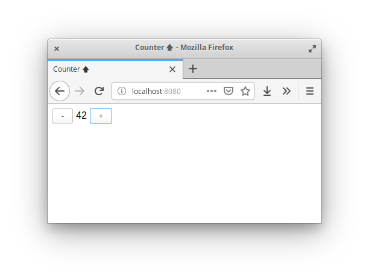

Simple counter application, useful for warming up with the coding style favoured
by Soil.

It uses [Rollup](https://rollupjs.org/) as module bundler, together with its
official TypeScript plugin for transpilation.

To start the application, run `npm start`.

___

