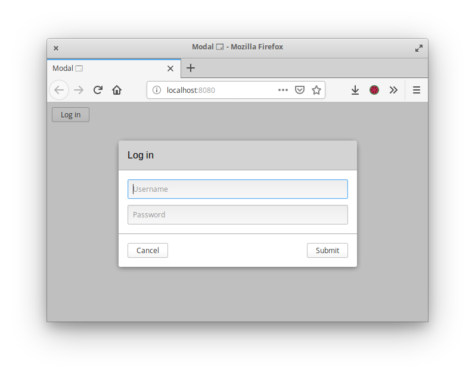

Example of an application using a modal window component.

[Browserify](http://browserify.org/) is used to bundle the compiled code and its
dependencies together, after using [TypeScript](https://www.typescriptlang.org/)
for transpilation into the CommonJS format.

To start the application, run `npm start`.

___

