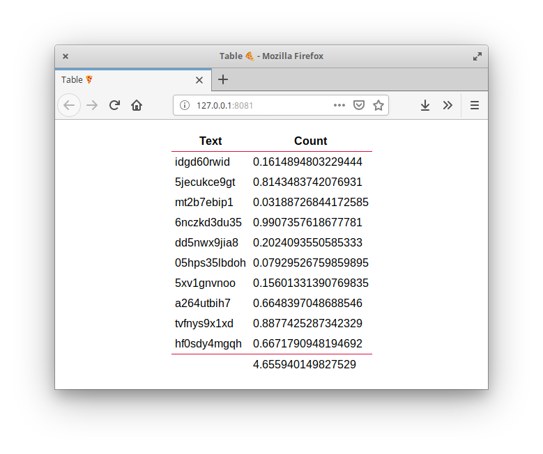

Table component with efficient updates, showing how generic functionality can be
cleanly encapsulated for reuse.

It uses [webpack](https://webpack.js.org/) as static module loader, together
with [ts-loader](https://github.com/TypeStrong/ts-loader) for transpilation.

To start the application, run `npm start`.

___

