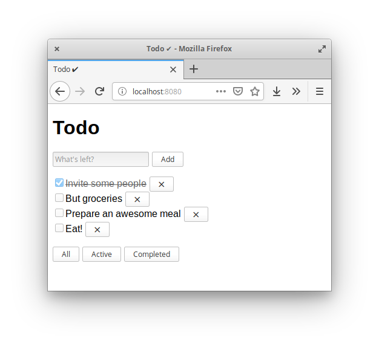

Minimalist to-do application, allowing the addition, removal, completion and
filtering of items. It shows in practice how components can be glued together,
as well as one way pure dependency injection can be implemented.

[RequireJS](http://requirejs.org/) is used as module loader, after using [TypeScript](https://www.typescriptlang.org/)
to transpile and bundle the files together using the AMD format.

To start the application, run `npm start`.

___

